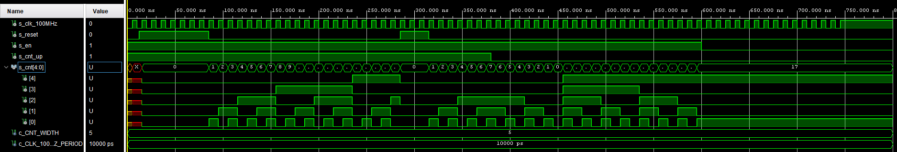
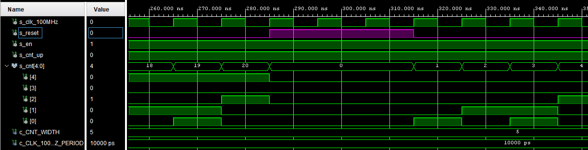
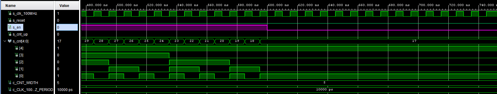
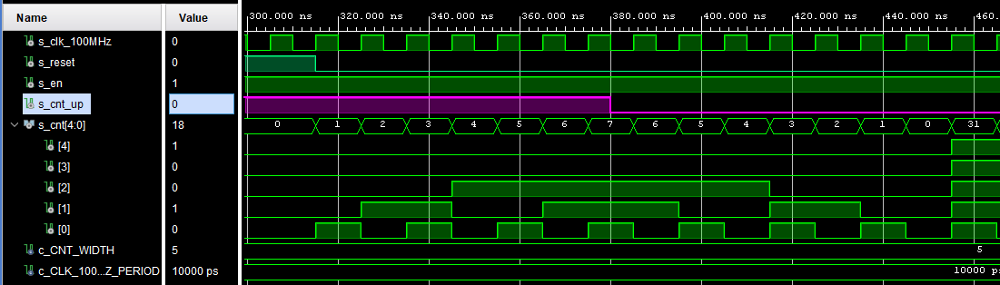
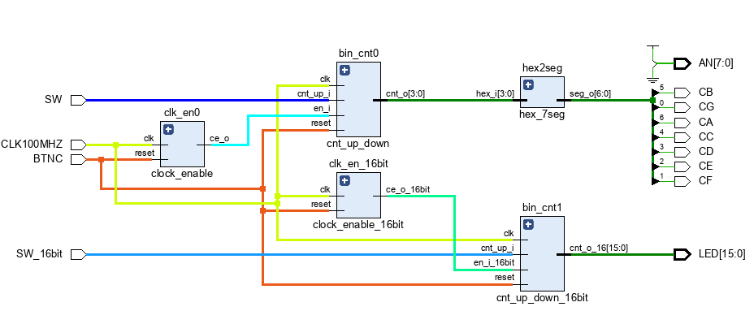

# Lab 6: Binary counter
## Preparation tasks (done before the lab at home)

The Nexys A7 board provides five push buttons for user applications.

1. Schematic of the Nexys A7 board and the connection of push buttons, ie to which FPGA pins are connected and how:
- The five pushbuttons arranged in a plus-sign configuration are “momentary” switches that normally generate a low output when they are at rest, and a high output only when they are pressed


2. How many periods of clock signal with frequency of 100&nbsp;MHz contain time intervals 2&nbsp;ms, 4&nbsp;ms, 10&nbsp;ms, 250&nbsp;ms, 500&nbsp;ms, and 1&nbsp;s. Write values in decimal, binary, and hexadecimal forms.


   | **Time interval** | **Number of clk periods** | **Number of clk periods in hex** | **Number of clk periods in binary** |
   | :-: | :-: | :-: | :-: |
   | 2&nbsp;ms | 200 000 | `x"3_0d40"` | `b"0011_0000_1101_0100_0000"` |
   | 4&nbsp;ms | 400 000 | `x"6_1a80"` | `b"0110_0001_1010_1000_0000"` |
   | 10&nbsp;ms | 1 000 000 | `x"f_4240"` | `b"1111_0100_0010_0100_0000"` |
   | 250&nbsp;ms | 25 000 000 | `x"17d_7840"` | `b"0001_0111_1101_0111_1000_0100_0000"` |
   | 500&nbsp;ms | 50 000 000 | `x"2fa_f080"` | `b"0010_1111_1010_1111_0000_1000_0000"` |
   | 1&nbsp;sec | 100 000 000 | `x"5f5_e100"` | `b"0101_1111_0101_1110_0001_0000_0000"` |

<a name="part1"></a>

# Lab 6: Bidirectional counter

1. Listing of VHDL code of the completed process `p_cnt_up_down`. Always use syntax highlighting, meaningful comments, and follow VHDL guidelines:

```vhdl
    --------------------------------------------------------
    -- p_cnt_up_down:
    -- Clocked process with synchronous reset which implements
    -- n-bit up/down counter.
    --------------------------------------------------------
    p_cnt_up_down : process(clk)
    begin
        if rising_edge(clk) then
        
            if (reset = '1') then   -- Synchronous reset
                s_cnt_local <= (others => '0'); -- Clear all bits

            elsif (en_i = '1') then -- Test if counter is enabled
               -- TEST COUNTER DIRECTION HERE
                if (cnt_up_i = '1') then
                    s_cnt_local <= s_cnt_local + 1;
                else 
                    s_cnt_local <= s_cnt_local - 1;  
                end if;     
            
            end if;
        end if;
    end process p_cnt_up_down;
```

2. Screenshot with simulated time waveforms. Test reset as well. Always display all inputs and outputs (display the inputs at the top of the image, the outputs below them) at the appropriate time scale!
 - Simulated time waveforms:
 

- Change of parameter `s_reset` 


- Change of parameter `s_en` 


- Change of parameter `s_cnt_up` 

### Two counters

1. Image of the top layer structure including both counters, ie a 4-bit bidirectional counter from *Part 4* and a 16-bit counter with a 10 ms time base:

   
   
Different time base changed in `tb_cnt_up_down_16bit`:
```vhdl
architecture testbench of tb_cnt_up_down_16bit is

    -- Number of bits for testbench counter
    constant c_CNT_WIDTH         : natural := 16;
    constant c_CLK_100MHZ_PERIOD : time    := 10 ms;

    --Local signals
    signal s_clk_100MHz : std_logic;
    signal s_reset      : std_logic;
    signal s_en_16bit        : std_logic;
    signal s_cnt_up     : std_logic;
    signal s_cnt_16        : std_logic_vector(c_CNT_WIDTH - 1 downto 0);
```

VHDL code for the shift register `top` level schematic:
```vhdl

library IEEE;
use IEEE.STD_LOGIC_1164.ALL;

-- Uncomment the following library declaration if using
-- arithmetic functions with Signed or Unsigned values
--use IEEE.NUMERIC_STD.ALL;

-- Uncomment the following library declaration if instantiating
-- any Xilinx leaf cells in this code.
--library UNISIM;
--use UNISIM.VComponents.all;

entity top is
    Port ( CLK100MHZ : in STD_LOGIC;
           SW : in STD_LOGIC;
           SW_16bit : in STD_LOGIC;
           BTNC : in STD_LOGIC; 
           LED : out STD_LOGIC_VECTOR (15 downto 0);
           CA : out STD_LOGIC;
           CB : out STD_LOGIC;
           CC : out STD_LOGIC;
           CD : out STD_LOGIC;
           CE : out STD_LOGIC;
           CF : out STD_LOGIC;
           CG : out STD_LOGIC;
           AN : out STD_LOGIC_VECTOR (7 downto 0));
           
end top;

architecture Behavioral of top is

 -- Internal clock enable
    signal s_en  : std_logic;
    signal s_en_16bit  : std_logic;
  -- Internal counter
    signal s_cnt : std_logic_vector(4 - 1 downto 0);
    signal s_cnt_16 : std_logic_vector(16 - 1 downto 0);
    
begin
--------------------------------------------------------------------
  -- Instance (copy) of clock_enable entity
  clk_en0 : entity work.clock_enable
      generic map(
          g_MAX => 25000000
      )
      port map(
          clk   => CLK100MHZ,
          reset => BTNC,
          ce_o  => s_en
      );
      
  clk_en_16bit : entity work.clock_enable_16bit
      generic map(
          g_MAX => 1000000
      )
      port map(
          clk   => CLK100MHZ,
          reset => BTNC,
          ce_o_16bit  => s_en_16bit
      );
  --------------------------------------------------------------------
  -- Instance (copy) of cnt_up_down entity
  bin_cnt0 : entity work.cnt_up_down
     generic map(
          g_CNT_WIDTH => 4
      )
      port map(
          clk   => CLK100MHZ,
          reset => BTNC,
          en_i  => s_en,
          cnt_up_i => SW,
          cnt_o   => s_cnt
      );
      
   bin_cnt1 : entity work.cnt_up_down_16bit
     generic map(
          g_CNT_WIDTH => 16
      )
      port map(
          clk   => CLK100MHZ,
          reset => BTNC,
          en_i_16bit  => s_en_16bit,
          cnt_up_i => SW_16bit,
          cnt_o_16   => s_cnt_16
      );     

  --------------------------------------------------------------------
  -- Instance (copy) of hex_7seg entity
  hex2seg : entity work.hex_7seg
      port map(
          hex_i    => s_cnt,
          seg_o(6) => CA,
          seg_o(5) => CB,
          seg_o(4) => CC,
          seg_o(3) => CD,
          seg_o(2) => CE,
          seg_o(1) => CF,
          seg_o(0) => CG
      );
  
  -- Connect one common anode to 3.3V
  AN <= b"1111_1100";

  -- Display counter values on LEDs
  LED(15 downto 0) <= s_cnt_16;

end architecture Behavioral;

```
