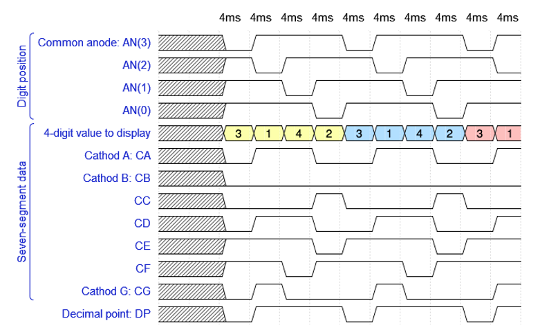
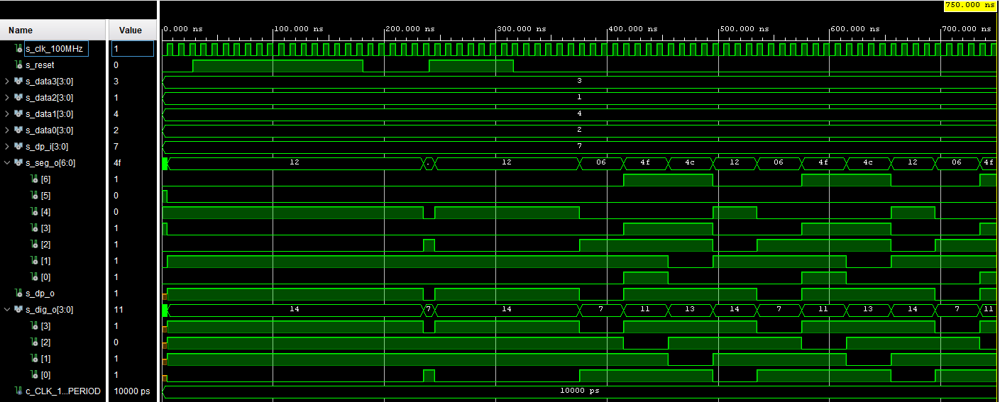
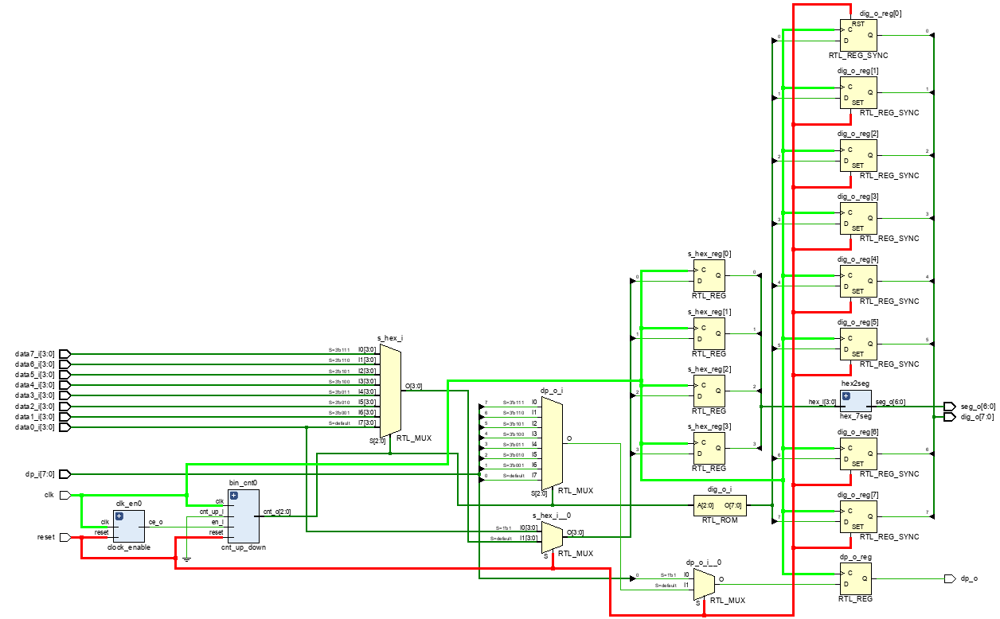

# Lab 7: Driver for multiple seven-segment displays

## Preparation tasks (done before the lab at home)

A common way to control multiple displays is to gradually switch between them. We control (connect to supply voltage) only one of the displays at a time, as can be seen [here](https://engineeringtutorial.com/seven-segment-display-working-principle/).

Due to the physiological properties of human vision, it is necessary that the time required to display the whole value is a maximum of 16&nbsp;ms. If we display four digits, then the duration of one of them is 4&nbsp;ms. If we display eight digits, the time is reduced to 2&nbsp;ms, etc.

1. See [schematic](https://github.com/tomas-fryza/Digital-electronics-1/blob/master/docs/nexys-a7-sch.pdf) or [reference manual](https://reference.digilentinc.com/reference/programmable-logic/nexys-a7/reference-manual) of the Nexys A7 board, find out the connection of 7-segment displays, and complete the signal timing to display four-digit value `3.142`.



  > The figure above was created in [WaveDrom](https://wavedrom.com/) digital timing diagram online tool. The figure source code is as follows:
  >
  ```javascript
  {
    signal:
    [
      ['Digit position',
        {name: 'Common anode: AN(3)', wave: 'xx01..01..01'},
        {name: 'AN(2)', wave: 'xx101..01..0'},
        {name: 'AN(1)', wave: 'xx1.01..01..'},
        {name: 'AN(0)', wave: 'xx1..01..01.'},
      ],
      ['Seven-segment data',
        {name: '4-digit value to display', wave: 'xx3333555599', data: ['3','1','4','2','3','1','4','2','3','1']},
        {name: 'Cathod A: CA', wave: 'xx01.0.1.0.1'},
        {name: 'Cathod B: CB', wave: 'xx0.........'},
        {name: 'CC', wave: 'xx0..10..10.'},
        {name: 'CD', wave: 'xx01.0.1.0.1'},
        {name: 'CE', wave: 'xx1..01..01.'},
        {name: 'CF', wave: 'xx1.01..01..'},
        {name: 'Cathod G: CG', wave: 'xx010..10..1'},
      ],
      {name: 'Decimal point: DP', wave: 'xx01..01..01'},
    ],
    head:
    {
      text: '             4ms   4ms   4ms   4ms   4ms   4ms   4ms   4ms   4ms   4ms',
    },
  }
  ```

<a name="part1"></a>

## Assignment
### Display driver

1. Listing of VHDL code of the completed process `p_mux`. Always use syntax highlighting, meaningful comments, and follow VHDL guidelines:

```vhdl
    --------------------------------------------------------
    -- p_mux:
    -- A sequential process that implements a multiplexer for
    -- selecting data for a single digit, a decimal point 
    -- signal, and switches the common anodes of each display.
    --------------------------------------------------------
    p_mux : process(clk)
    begin
        if rising_edge(clk) then
            if (reset = '1') then
                s_hex <= data0_i;
                dp_o  <= dp_i(0);
                dig_o <= "1110";
            else
                case s_cnt is
                    when "11" =>
                        s_hex <= data3_i;
                        dp_o  <= dp_i(3);
                        dig_o <= "0111";

                    when "10" =>
                        s_hex <= data2_i;
                        dp_o  <= dp_i(2);
                        dig_o <= "1011";

                    when "01" =>
                        s_hex <= data1_i;
                        dp_o  <= dp_i(1);
                        dig_o <= "1101";

                    when others =>
                        s_hex <= data0_i;
                        dp_o  <= dp_i(0);
                        dig_o <= "1110";
                end case;
            end if;
        end if;
    end process p_mux;
 ```
2. Screenshot with simulated time waveforms. Test reset as well. Always display all inputs and outputs (display the inputs at the top of the image, the outputs below them) at the appropriate time scale!

   

### Eight-digit driver

1. Image of the 8-digit driver's block schematic. The image can be drawn on a computer or by hand. Always name all inputs, outputs, components and internal signals!
    
   
   
   `driver_7seg_8digits`:
   ```vhdl
    p_mux : process(clk)
    begin
        if rising_edge(clk) then
            if (reset = '1') then
                s_hex <= data0_i;
                dp_o  <= dp_i(0);
                dig_o <= "11111110";
            else
                case s_cnt is
                    when "111" =>
                        s_hex <= data7_i;
                        dp_o  <= dp_i(7);
                        dig_o <= "01111111";
                        
                    when "110" =>
                        s_hex <= data6_i;
                        dp_o  <= dp_i(6);
                        dig_o <= "10111111";
                    
                    when "101" =>
                        s_hex <= data5_i;
                        dp_o  <= dp_i(5);
                        dig_o <= "11011111";
                        
                    when "100" =>
                        s_hex <= data4_i;
                        dp_o  <= dp_i(4);
                        dig_o <= "11101111";
                                    
                    when "011" =>
                        s_hex <= data3_i;
                        dp_o  <= dp_i(3);
                        dig_o <= "11110111";

                    when "010" =>
                        s_hex <= data2_i;
                        dp_o  <= dp_i(2);
                        dig_o <= "11111011";

                    when "001" =>
                        s_hex <= data1_i;
                        dp_o  <= dp_i(1);
                        dig_o <= "11111101";

                    when others =>
                        s_hex <= data0_i;
                        dp_o  <= dp_i(0);
                        dig_o <= "11111110";
                end case;
            end if;
        end if;
    end process p_mux;

   ```
   
   `tb_driver_7seg_8digits`:
   ```vhdl
   
library ieee;
use ieee.std_logic_1164.all;

------------------------------------------------------------
-- Entity declaration for testbench
------------------------------------------------------------
entity tb_driver_7seg_8digits is
    -- Entity of testbench is always empty
end entity tb_driver_7seg_8digits;

------------------------------------------------------------
-- Architecture body for testbench
------------------------------------------------------------
architecture testbench of tb_driver_7seg_8digits is

    -- Local constants
    constant c_CLK_100MHZ_PERIOD : time := 10 ns;

    -- Local signals
    signal s_clk_100MHz : std_logic;
    signal s_reset : std_logic;
    -- ADD OTHER SIGNALS ACCORDING TO DRIVER_7SEG_4DIGITS ENTITY
    -- signal s_data0 : ...
    signal s_data0 : std_logic_vector(4-1 downto 0);
    signal s_data1 : std_logic_vector(4 - 1 downto 0);
    signal s_data2 : std_logic_vector(4 - 1 downto 0);
    signal s_data3 : std_logic_vector(4 - 1 downto 0);
    signal s_data4 : std_logic_vector(4 - 1 downto 0);
    signal s_data5 : std_logic_vector(4 - 1 downto 0);
    signal s_data6 : std_logic_vector(4 - 1 downto 0);
    signal s_data7 : std_logic_vector(4 - 1 downto 0);
    signal s_dp_i : std_logic_vector(8 - 1 downto 0);
    signal s_seg_o : std_logic_vector(7 - 1 downto 0);
    signal s_dp_o : std_logic;
    signal s_dig_o : std_logic_vector(8 - 1 downto 0);

begin
    -- Connecting testbench signals with driver_7seg_4digits
    -- entity (Unit Under Test)
    -- MAP I/O PORTS FROM ENTITY TO LOCAL SIGNALS
    -- uut_driver_7seg_4digits : entity work....
    -- Connecting testbench signals with clock_enable entity
    -- (Unit Under Test)
    uut_ce : entity work.driver_7seg_8digits
        port map(
            clk   => s_clk_100MHz,
            reset => s_reset,
            data0_i => s_data0,
            data1_i => s_data1,
            data2_i => s_data2,
            data3_i => s_data3,
            data4_i => s_data4,
            data5_i => s_data5,
            data6_i => s_data6,
            data7_i => s_data7,
            dp_i => s_dp_i,
            dp_o => s_dp_o,
            seg_o => s_seg_o,
            dig_o => s_dig_o
        );
    
    --------------------------------------------------------
    -- Clock generation process
    --------------------------------------------------------
    p_clk_gen : process
    begin
        while now < 750 ns loop -- 75 periods of 100MHz clock
            s_clk_100MHz <= '0';
            wait for c_CLK_100MHZ_PERIOD / 2;
            s_clk_100MHz <= '1';
            wait for c_CLK_100MHZ_PERIOD / 2;
        end loop;
        wait;
    end process p_clk_gen;

    --------------------------------------------------------
    -- Reset generation process
    --------------------------------------------------------
    -- WRITE YOUR CODE HERE AND ACTIVATE RESET FOR A WHILE
    
     p_reset_gen : process
     begin
        s_reset <= '0';
        wait for 28 ns;
        
        -- Reset activated
        s_reset <= '1';
        wait for 153 ns;

        -- Reset deactivated
        s_reset <= '0';
        wait for 59 ns;
        
        
        s_reset <= '1';
        wait for 76 ns;
        
        s_reset <= '0';
        wait;
    end process p_reset_gen;
    --------------------------------------------------------
    -- Data generation process
    --------------------------------------------------------
    -- WRITE YOUR CODE HERE AND TEST INPUT VALUE "3.142"
    p_stimulus : process
    begin
        report "Stimulus process started" severity note;
        s_data7 <= "0011";
        s_data6 <= "0001";
        s_data5 <= "0100";
        s_data4 <= "0010";
        s_data3 <= "0011";
        s_data2 <= "0001";
        s_data1 <= "0100";
        s_data0 <= "0010";
        s_dp_i <= "01110111";
        --wait for 100 ns;
        report "Stimulus process finished" severity note;
        wait;
    end process p_stimulus;

end architecture testbench;
   ```
